# Real Estate Market Analysis
## Executive Business Intelligence Report

---

## Executive Summary

This report presents a comprehensive analysis of 2,800 real estate listings, revealing critical market dynamics, pricing patterns, and strategic opportunities. The findings provide actionable insights for investment decisions, market positioning, and revenue optimization strategies.

**Key Market Overview:**
- **Total Market Size:** 2,800 active listings
- **Sales Market:** 2,206 properties (79% of inventory)
- **Rental Market:** 480 properties (17% of inventory)
- **Average Sale Price:** 276,544 AZN
- **Market Range:** 7,000 AZN to 3,800,000 AZN

---

## 1. Market Composition & Transaction Opportunities

### What the Data Shows

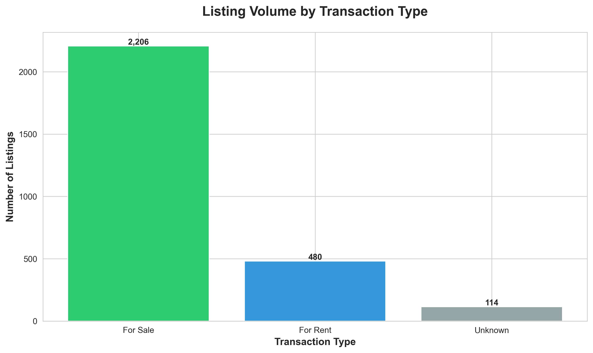

The market is heavily weighted toward property sales, with sales listings outnumbering rental opportunities by nearly 5:1. This indicates strong investment and ownership demand in the market.

### Business Impact

**For Investors:** The sales-dominated market suggests:
- Strong buyer interest and capital availability
- Opportunities for property acquisition and portfolio growth
- Potential undersupply in the rental market creating arbitrage opportunities

**Strategic Recommendation:** Consider purchasing properties in the sales market for conversion to rentals, as the rental segment appears underserved relative to demand indicators.

---

## 2. Property Type Distribution: Where the Inventory Lies

### What the Data Shows

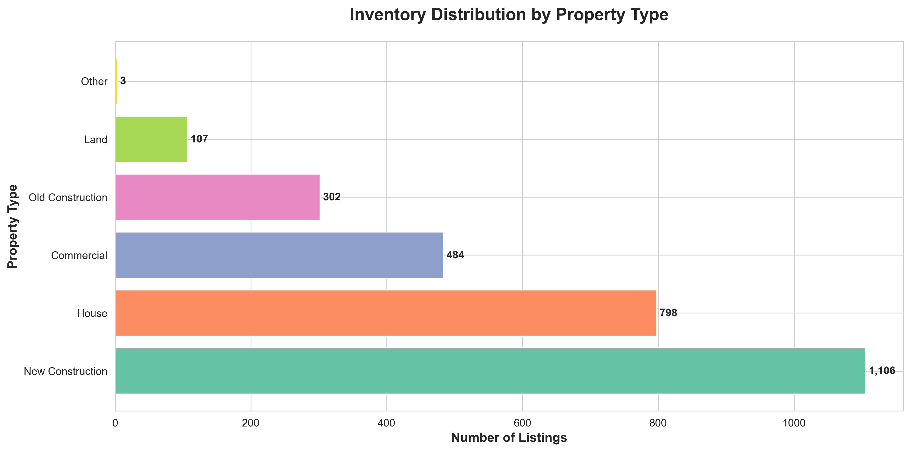

New construction properties dominate the market at nearly 40% of all listings (1,106 properties), followed by houses and old construction apartments. This distribution reveals where market activity is concentrated.

### Business Impact

**Why This Matters:**
- **New Construction Dominance** signals active development and modernization
- Buyers clearly prefer modern amenities and contemporary design
- Developers are responding to market demand with significant new supply
- Opportunity exists in renovation of older properties to capture premium pricing

**Market Opportunity:** The strong preference for new construction creates two strategic paths:
1. Develop new projects to meet continued demand
2. Acquire older properties for renovation and repositioning at premium prices

---

## 3. Price Distribution: Understanding Market Segments

### What the Data Shows

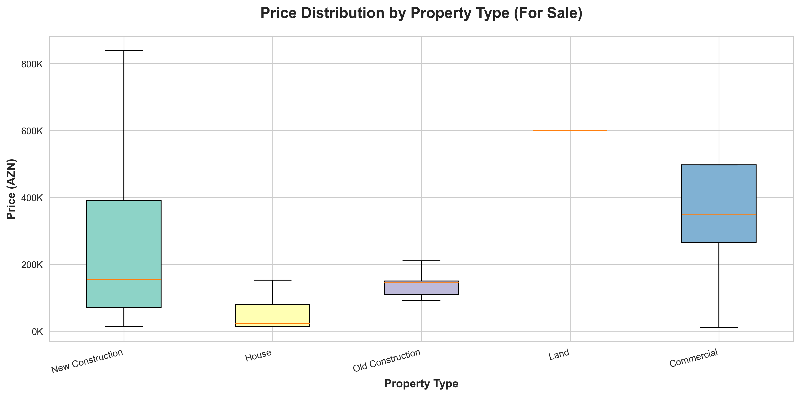

Price variations across property types reveal distinct market segments, with commercial properties and new construction commanding premium positions, while houses show wider price dispersion.

### Business Impact

**Critical Insight:** Price volatility within property types indicates:
- **High differentiation potential** based on location, quality, and features
- Opportunities to create value through strategic positioning
- Need for precise market segmentation in pricing strategy

**Revenue Implications:** Properties within the same category can command vastly different prices, suggesting that factors beyond property type drive value—location, amenities, and condition are critical differentiators.

---

## 4. Average Pricing by Property Type: Premium Segments

### What the Data Shows

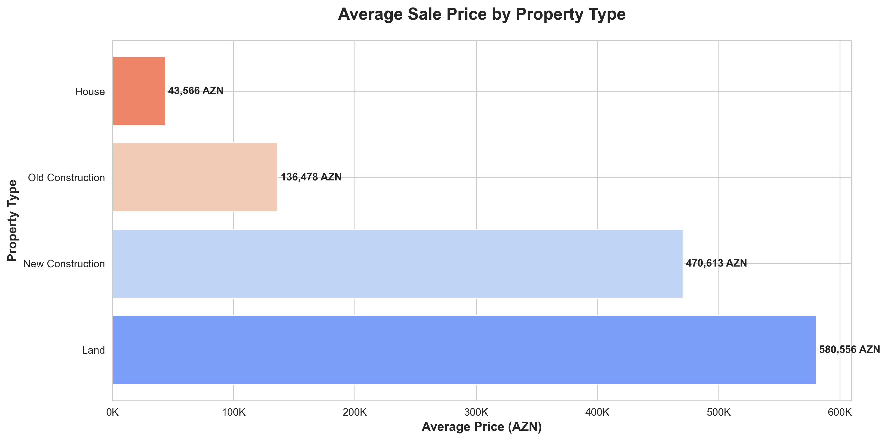

Commercial properties and new construction lead average pricing, with commercial spaces averaging the highest values. Land and certain residential categories follow, while houses show more moderate average pricing.

### Business Impact

**Investment Strategy:**
- **Commercial real estate** represents the premium segment with highest average transaction values
- **New construction** commands price premiums, validating investment in quality and modernity
- The pricing hierarchy guides portfolio allocation and development priorities

**Profit Maximization:** Focus development and acquisition resources on commercial and new construction segments where average transaction values—and therefore absolute profit potential—are highest.

---

## 5. Geographic Distribution: Market Hotspots

### What the Data Shows

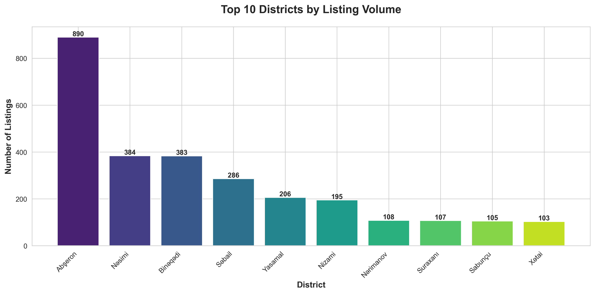

Abşeron district dominates market activity with 890 listings—nearly 32% of all properties. This extreme concentration indicates where buyer attention and development activity are focused.

### Business Impact

**Why This Matters:**
- **Abşeron's dominance** suggests established infrastructure and buyer confidence
- High listing volume in specific areas indicates proven demand
- Other districts with lower volume may represent emerging opportunities or areas with barriers

**Strategic Considerations:**
- **High-volume markets** (Abşeron) offer liquidity and established buyer pools
- **Lower-volume markets** may offer less competition but require more careful evaluation
- Market concentration creates risk—diversification across districts may reduce exposure

---

## 6. Price Levels by Location: Premium vs. Value Markets

### What the Data Shows

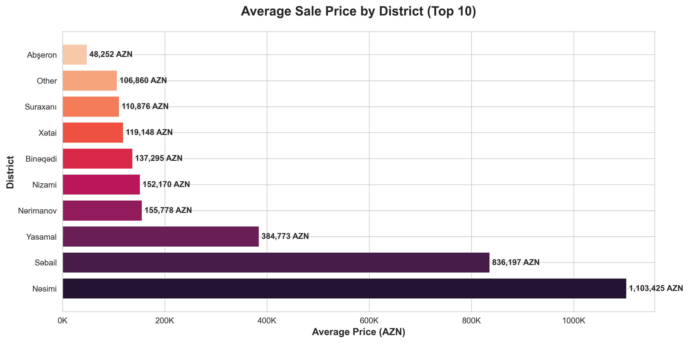

Geographic pricing reveals dramatic variations, with certain districts commanding 3-4x higher average prices than others. This dispersion identifies premium and value markets within the region.

### Business Impact

**Critical Decision Factors:**

**For High-End Development:**
- Target districts with proven ability to support premium pricing
- These areas offer higher revenue per transaction but may have increased competition

**For Volume Strategy:**
- Lower-priced districts enable faster inventory turnover
- Accessible price points expand buyer pool and reduce time-to-sale
- Total revenue through volume can match or exceed premium market returns

**Risk Management:** Price gaps between districts indicate varying levels of buyer purchasing power, infrastructure quality, and growth potential. Due diligence on district-specific factors is essential.

---

## 7. Value Metrics: Price Per Square Meter Analysis

### What the Data Shows

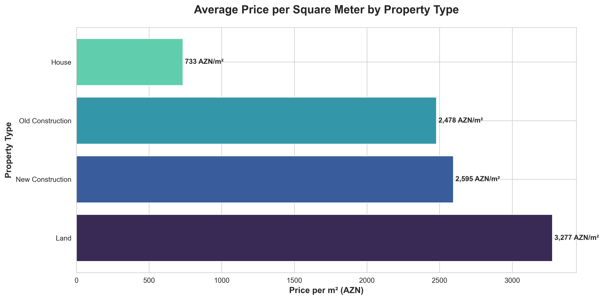

Average price per square meter is 1,428 AZN, with median at 1,250 AZN. This standardized metric reveals which property types deliver the most value per unit of space.

### Business Impact

**Why This Metric Matters:**

Price per square meter is the fundamental efficiency measure in real estate, revealing:
- Which property types command premiums for space efficiency
- Where buyers are willing to pay more for location or amenities
- Opportunities for value creation through space optimization

**Application for Decision-Making:**
- **Development projects:** Target configurations that optimize revenue per square meter
- **Acquisitions:** Compare asking price per sqm against market averages to identify undervalued properties
- **Renovations:** Investments that increase usable or perceived space deliver measurable ROI

---

## 8. Room Configuration Demand: What Buyers Want

### What the Data Shows

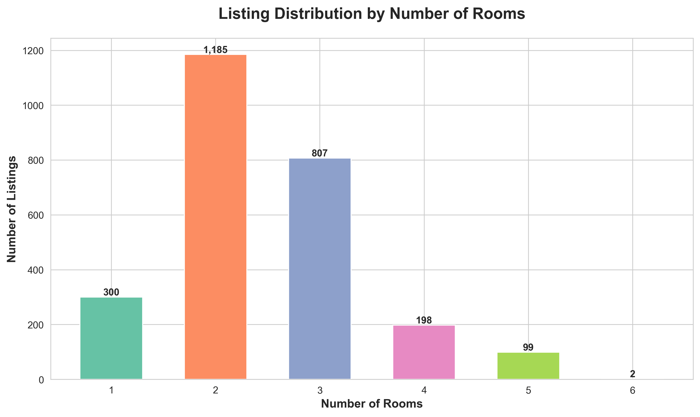

Two-room properties dominate the market, representing the most common listing type by significant margin. This reveals clear buyer preference and optimal product-market fit.

### Business Impact

**Product Development Insight:**

The overwhelming preference for 2-room configurations indicates:
- **Target buyer profile:** Small families, young professionals, or investors seeking rentable units
- **Affordability sweet spot:** 2-room units balance space needs with accessible pricing
- **Supply-demand alignment:** Market understands and serves this core segment well

**Strategic Implications:**
- **Developers:** Design projects with 2-room units as the core product
- **Investors:** 2-room properties offer highest liquidity and fastest transaction times
- **Risk:** Over-concentration in 2-room segment may signal emerging opportunity in underserved 3+ room luxury segment

---

## 9. Price Scaling by Size: The Value of Additional Space

### What the Data Shows

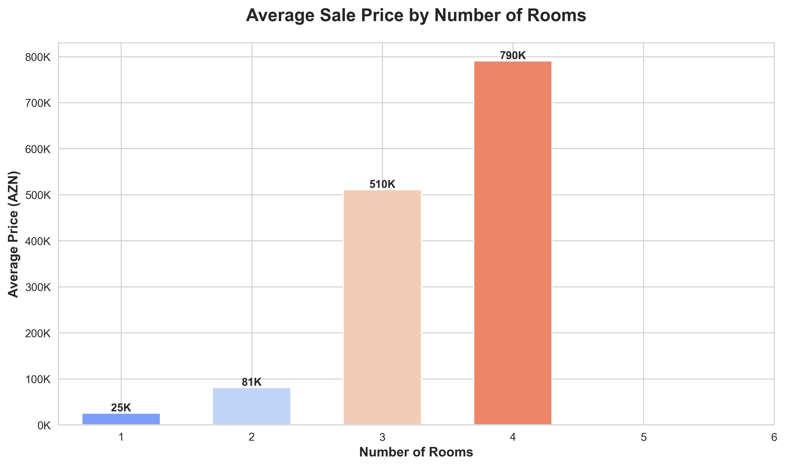

Property prices increase progressively with room count, but the incremental price per additional room decreases, revealing the economics of space in the market.

### Business Impact

**Pricing Intelligence:**

This trend shows that:
- Buyers pay significantly more for additional space, but with diminishing returns
- 2-3 room properties occupy the optimal value zone
- Larger properties (4+ rooms) require specific buyer segments with higher budgets

**Revenue Strategy:**
- **Maximize occupancy:** Multiple smaller units (2-3 rooms) can generate more total revenue than fewer large units in the same building footprint
- **Segment targeting:** Luxury market (4+ rooms) requires different marketing, positioning, and longer sales cycles
- **Development planning:** Unit mix should balance high-margin larger units with high-turnover smaller units

---

## 10. Property Size Patterns: Market Size Preferences

### What the Data Shows

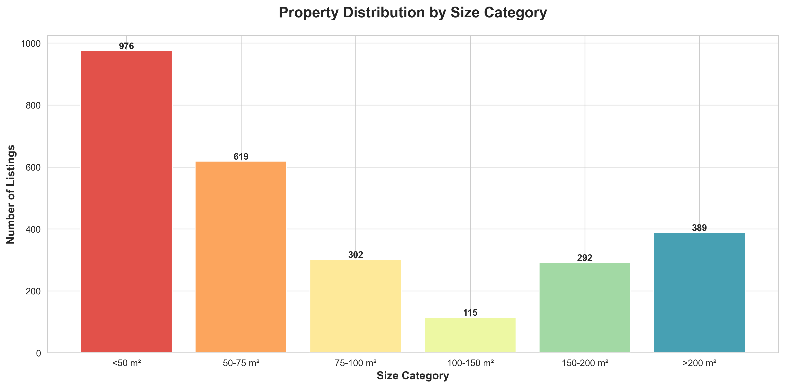

The market clusters around 50-100 m² properties, with median property size at 71 m² and average at 122 m². This concentration reveals the market's size preferences.

### Business Impact

**Space Optimization Strategy:**

The data demonstrates:
- **Core market demand:** 50-100 m² represents the sweet spot for volume
- Properties below 50 m² serve a niche (potentially rental or entry-level)
- Properties above 150 m² target affluent buyers—smaller segment, higher margins

**Development Implications:**
- **Land use efficiency:** Design projects around 70-100 m² units for maximum market appeal
- **Cost management:** Standardizing around common sizes reduces construction complexity
- **Market timing:** Smaller units sell faster; larger units require patient capital

---

## 11. Rental Market Dynamics: Income-Generating Opportunities

### What the Data Shows

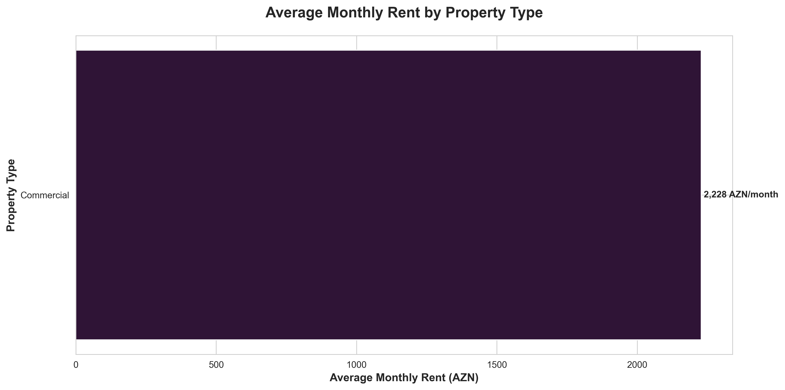

The rental market shows distinct pricing by property type, with commercial spaces commanding highest monthly rents. This reveals income potential across different rental strategies.

### Business Impact

**Yield Considerations:**

For investors evaluating rental income:
- **Commercial rentals** offer highest monthly cash flow per property
- **Residential rentals** provide more stable, long-term tenant relationships
- Monthly rental rates must be evaluated against acquisition costs to calculate yield

**Strategic Investment Decision:**

Calculate return on investment (ROI) by comparing:
- Purchase price ÷ annual rental income = payback period
- Commercial properties may have higher income but also higher acquisition costs
- Residential properties offer balance of affordability and stable returns

**Risk Assessment:** Rental markets carry vacancy risk; areas with highest listing volumes suggest strong renter demand.

---

## 12. Market Segmentation: Price Range Distribution

### What the Data Shows

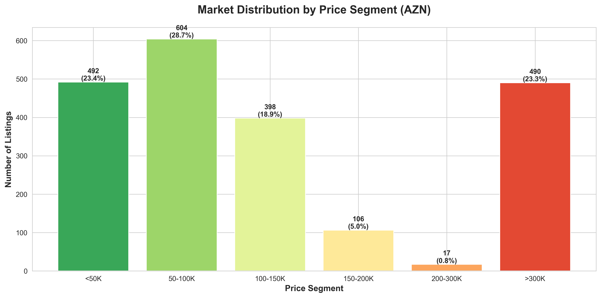

The market divides into clear price segments, with the majority of listings concentrated in the 50-150K AZN range. This distribution reveals the market's accessibility and segmentation structure.

### Business Impact

**Market Structure Analysis:**

**Mass Market (Under 150K AZN):**
- Represents the largest buyer pool
- Fastest liquidity and transaction velocity
- Lower margins but higher volume potential
- Ideal for investors seeking quick turnover

**Mid-Market (150-300K AZN):**
- Balance of quality and accessibility
- Growing segment as market matures
- Opportunity for differentiation and premium positioning

**Premium Market (300K+ AZN):**
- Smaller buyer pool but higher margins
- Requires sophisticated marketing and extended sales cycles
- Potential for significant per-transaction profits

**Portfolio Strategy:** Diversified portfolio across segments balances risk, liquidity, and return potential.

---

## Strategic Recommendations

Based on the comprehensive market analysis, the following strategic priorities emerge:

### 1. Market Entry & Positioning
- **Primary Focus:** Target the 50-150K price segment for maximum market share and liquidity
- **Product Type:** Prioritize 2-room new construction properties around 70-100 m²
- **Geographic Strategy:** Establish presence in Abşeron (proven demand) while exploring secondary districts for value opportunities

### 2. Revenue Optimization
- **Price positioning:** Aim for 1,250-1,500 AZN per square meter to remain competitive
- **Unit mix:** Allocate 60-70% of development to 2-room configurations, 20-25% to 3-room, 10-15% to larger units
- **Segment balance:** Maintain portfolio across multiple price segments to manage risk

### 3. Investment Priorities
- **New construction:** Continue focus on modern developments—market clearly rewards quality and contemporary amenities
- **Commercial opportunities:** Explore commercial property acquisitions for rental income generation
- **Renovation potential:** Identify older properties in premium districts for value-add repositioning

### 4. Risk Management
- **Geographic diversification:** Don't over-concentrate in single district despite Abşeron's dominance
- **Segment diversification:** Balance between sales and rental properties for income stability
- **Price point spread:** Maintain properties across price segments to weather market cycles

### 5. Market Timing Considerations
- **Sales market strength:** The 79% sales weighting indicates strong transaction activity—favorable for development and sales strategies
- **Rental opportunity:** The smaller rental segment (17%) suggests potential undersupply—opportunity for investors seeking stable income
- **Development pipeline:** High new construction volume indicates active supply growth—monitor for potential oversupply risks

---

## Conclusion

The real estate market demonstrates clear patterns and opportunities:

- **Strong fundamentals:** High sales activity, clear buyer preferences, and established pricing patterns
- **Defined market segments:** Distinct property types, price ranges, and geographic concentrations enable precise targeting
- **Strategic opportunities:** Underserved rental market, value-add renovation potential, and emerging districts offer growth paths
- **Actionable intelligence:** Data supports confident decision-making across acquisition, development, pricing, and positioning strategies

**The market rewards:**
- Modern construction quality
- Optimal sizing (2-room, 70-100 m²)
- Strategic location selection
- Competitive pricing aligned with market benchmarks

Organizations that align their strategies with these market realities—and execute with discipline on product, pricing, and positioning—are positioned to capture significant market share and achieve superior returns.

---

## Appendix: Data Summary

**Market Overview:**
- Total Listings Analyzed: 2,800
- Geographic Coverage: 10+ districts
- Property Types: 7+ categories
- Price Range: 7,000 - 3,800,000 AZN

**Key Metrics:**
- Average Sale Price: 276,544 AZN
- Median Sale Price: 110,000 AZN
- Average Price/m²: 1,428 AZN
- Median Price/m²: 1,250 AZN
- Average Property Size: 122 m²
- Median Property Size: 71 m²

**Market Composition:**
- Sales Listings: 79%
- Rental Listings: 17%
- Other: 4%

**Top Property Type:** New Construction (39.5%)
**Top District:** Abşeron (31.8%)
**Most Common Configuration:** 2 rooms

---

*This analysis provides strategic business intelligence for decision-making purposes. All recommendations should be validated with additional market research, financial modeling, and professional consultation before implementation.*
